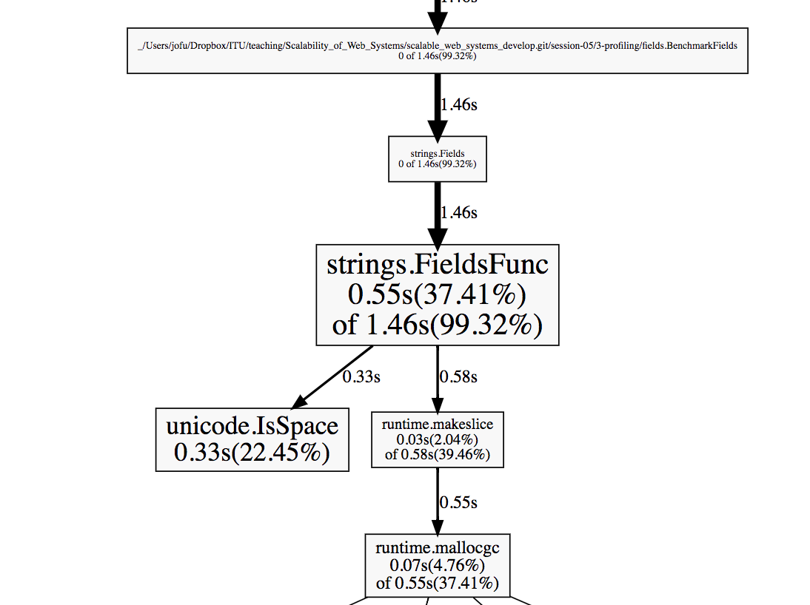
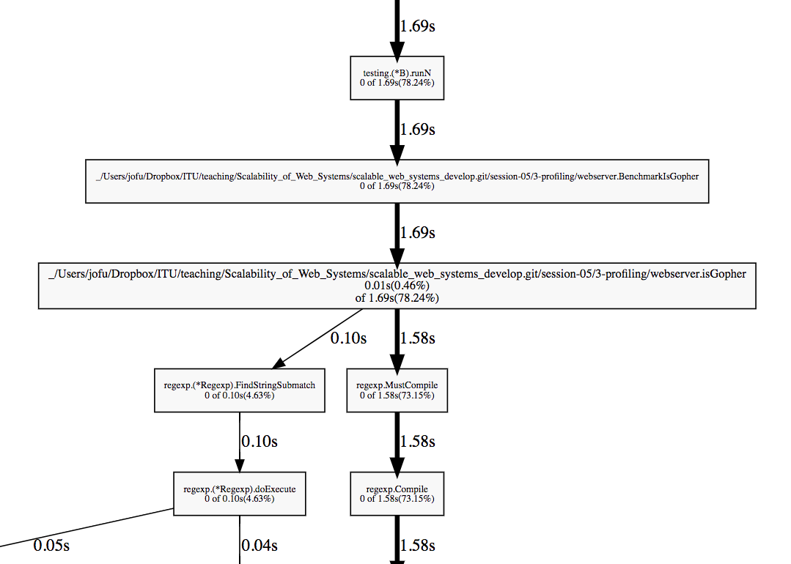
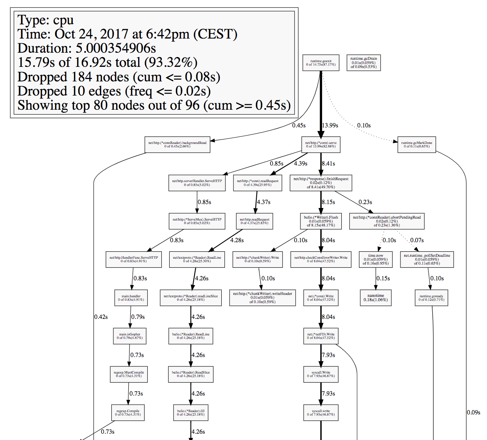

# Understanding performance with pprof

In order to better understand how a program performs we can use a similar
approach to the one we used with code coverage, back in the
[testing chapter](../2-testing/2-code-coverage.md).

The idea here is we will periodicallly check what a program is running,
exactly what line of code it's executing at that given time. By doing this
often enough and for a long enough period of time, we can figure out what lines
of code we spend the longest time executing!

This is, again, not a perfect tool as Filippo Valsorda explains during
[this talk](https://speakerdeck.com/filosottile/you-latency-and-profiling-at-gophercon-india-2017) but it is a very good indication for many cases. So let's learn how to use
it with Go.

## Generating pprof profiles from benchmarks

The easiest way to use pprof is by adding the `-cpuprofile` flag to any benchmark.

Let's add that flag to the same benchmark for `strings.Fields` we saw before.

```bash
$ go test -bench=. -cpuprofile=cpu.pprof
BenchmarkFields-8   	 5000000	       265 ns/op
PASS
ok  	_/Users/jofu/Dropbox/ITU/teaching/Scalability_of_Web_Systems/scalable_web_systems_develop.git/session-05/3-profiling/fields	1.609s
```

In addition to the benchmark output, two new files were created.
- cpu.pprof:  It is a binary file, so no need to try to read it manually. Instead, we're going to use the `pprof` tool to read it.
- x.test: where x corresponds to the name of the current directory. It's the test binary that runs the benchmarks.

## Reading pprof profiles with `go tool pprof`

Once we have the test binary and the pprof profile, we can use the `pprof`
tool under `go tool` to analyze the profile:

```bash
$ go tool pprof fields.test cpu.pprof
Entering interactive mode (type "help" for commands)
(pprof)
```

This is an interactive console, the most important commands in my opinion are:

- top: shows the lines of code that were sampled the most often.

```bash
(pprof) top
(pprof) top
1.45s of 1.47s total (98.64%)
Showing top 10 nodes out of 35 (cum >= 0.01s)
      flat  flat%   sum%        cum   cum%
     0.55s 37.41% 37.41%      1.46s 99.32%  strings.FieldsFunc
     0.33s 22.45% 59.86%      0.33s 22.45%  unicode.IsSpace
     0.23s 15.65% 75.51%      0.23s 15.65%  runtime.heapBitsSetType
     0.17s 11.56% 87.07%      0.17s 11.56%  runtime.mach_semaphore_signal
     0.07s  4.76% 91.84%      0.55s 37.41%  runtime.mallocgc
     0.04s  2.72% 94.56%      0.04s  2.72%  runtime.memclrNoHeapPointers
     0.03s  2.04% 96.60%      0.58s 39.46%  runtime.makeslice
     0.01s  0.68% 97.28%      0.01s  0.68%  runtime.(*gcSweepBuf).push
     0.01s  0.68% 97.96%      0.01s  0.68%  runtime.deductSweepCredit
     0.01s  0.68% 98.64%      0.01s  0.68%  runtime.gopreempt_m
```

- list strings.FieldsFunc: shows how much time we spent per line of code in `strings.Fields`.

```bash
(pprof) list strings.FieldsFunc
Total: 1.47s
ROUTINE ======================== strings.FieldsFunc in /usr/local/Cellar/go/1.8.3/libexec/src/strings/strings.go
     550ms      1.46s (flat, cum) 99.32% of Total
         .          .    304:// If f does not return consistent results for a given c, FieldsFunc may crash.
         .          .    305:func FieldsFunc(s string, f func(rune) bool) []string {
         .          .    306:	// First count the fields.
         .          .    307:	n := 0
         .          .    308:	inField := false
     140ms      140ms    309:	for _, rune := range s {
      10ms       10ms    310:		wasInField := inField
      50ms      260ms    311:		inField = !f(rune)
         .          .    312:		if inField && !wasInField {
      10ms       10ms    313:			n++
         .          .    314:		}
         .          .    315:	}
         .          .    316:
         .          .    317:	// Now create them.
         .      580ms    318:	a := make([]string, n)
         .          .    319:	na := 0
         .          .    320:	fieldStart := -1 // Set to -1 when looking for start of field.
      90ms       90ms    321:	for i, rune := range s {
      30ms      150ms    322:		if f(rune) {
      20ms       20ms    323:			if fieldStart >= 0 {
      60ms       60ms    324:				a[na] = s[fieldStart:i]
         .          .    325:				na++
         .          .    326:				fieldStart = -1
         .          .    327:			}
      40ms       40ms    328:		} else if fieldStart == -1 {
         .          .    329:			fieldStart = i
         .          .    330:		}
         .          .    331:	}
         .          .    332:	if fieldStart >= 0 { // Last field might end at EOF.
      60ms       60ms    333:		a[na] = s[fieldStart:]
         .          .    334:	}
      40ms       40ms    335:	return a
         .          .    336:}
         .          .    337:
         .          .    338:// Join concatenates the elements of a to create a single string. The separator string
         .          .    339:// sep is placed between elements in the resulting string.
         .          .    340:func Join(a []string, sep string) string {
```

- web: show a graph with all the functions called and the time we spent on each.

```bash
(pprof) web
Failed to execute dot. Is Graphviz installed? Error: exec: "dot": executable file not found in $PATH
```

Oh, it seems we're missing something! Make sure you installed [Graphviz](http://www.graphviz.org/) first.

```bash
$ go tool pprof fields.test cpu.pprof
File: 3-profiling.test
Type: cpu
Time: Jun 29, 2017 at 3:30pm (EDT)
Duration: 5.03s, Total samples = 4.31s (85.70%)
Entering interactive mode (type "help" for commands, "o" for options)
(pprof) web
```

This will generate an SVG file and open it. Make sure your computer is set up
so your `.svg` files are opened with something that works (Chrome or Firefox work well).



We can see that most of the time is spent creating a slice `runtime.makeslice`.

### Exercise: visualizing the result of pprof on `isGopher`

Using the same benchmark you wrote on the previous chapter for the webserver, run it again with
`-cpuprofile` in order to generate a CPU profile and visualize it with pprof.

Do not modify the code of `isGopher` just yet, simply analyze it and try to understand
what we could improve.

<details>

Admitting that you wrote a benchmark somehow looking like this:

```go
package main

import "testing"

var name string
var ok bool

func BenchmarkIsGopher(b *testing.B) {
	for i := 0; i < b.N; i++ {
		name, ok = isGopher("jonf@itu.dk")
	}
}
```

You should be able to run it with:

```bash
$ go test -bench=. -cpuprofile pprof.cpu
BenchmarkIsGopher-8   	  200000	      9587 ns/op
PASS
ok  	_/Users/jofu/Dropbox/ITU/teaching/Scalability_of_Web_Systems/scalable_web_systems_develop.git/session-05/3-profiling/webserver	2.033s
```

Finally, using `go tool pprof` you can visualize the analysis as a graph.

```bash
$ go tool pprof webserver.test pprof.cpu
Entering interactive mode (type "help" for commands, "o" for options)
(pprof) web
```

You should see a graph that starts with something similar to this graph.



</details>

## Generating profiles from running HTTP servers

Benchmarks are great, but you need to write them. Wouldn't it be cool to obtain CPU
profiles directly from a running web server? That's exactly what the
[net/http/pprof](https://golang.org/pkg/net/http/pprof) provides.

Simply add an import statement of that package. You will need to import it with an
underscore (`_`) as the package name, since we're importing for the side effects of
the initialization rather than to refer to any of the identifiers defined in the package.

```go
import _ "net/http/pprof"
```

Add it to the webserver we were working with previously, so we can analyze the whole endpoint
rather than just `isGopher`. Who knows, maybe there's something we can optimize there too!

Once you've added that import statement, recompile the program and run it again.
Now you can visit http://localhost:8080/debug/pprof/ in order to have a snapshot
of the current activity of the server. Explore this dashboard.

This is how most processes work at Google! They expose a web server with an
endpoint that exposes metrics we can create dashboards on. Pretty simple, but
powerful.

Click on the `full goroutine stack dump` link to see what every goroutine is
executing at this point. This endpoint is the one we're going to use to let
`go tool pprof` analyze the performance of a running HTTP server.

```bash
$ go tool pprof -seconds 5 http://localhost:8080/debug/pprof/profile
Fetching profile over HTTP from http://localhost:8080/debug/pprof/profile?seconds=5
Please wait... (5s)
Saved profile in /Users/jofu/pprof/pprof.localhost:8080.samples.cpu.001.pb.gz
Entering interactive mode (type "help" for commands)
(pprof)
```

This command just analyzed 5 seconds of the activity by the HTTP server behind
that endpoint, and now it's ready to expose the data.
Let's try running `top` to have an idea of the content of the profile.

```
(pprof) top
profile is empty
```

What hapenned? Well, during the time we were analyzing
the server there was no traffic, so nothing got recorded.

Let's try again, this time sending some traffic with `go-wrk` first, then starting
`go tool pprof`.

In a terminal run:

```bash
$ go-wrk -d 30 http://localhost:8080
```

This will take around a minute to run, so in the meanwhile we can run
`go tool pprof`.

```bash
$ go tool pprof -seconds 5 http://localhost:8080/debug/pprof/profile
Fetching profile from http://localhost:8080/debug/pprof/profile?seconds=5
Please wait... (5s)
Saved profile in /Users/jofu/pprof/pprof.localhost:8080.samples.cpu.002.pb.gz
Entering interactive mode (type "help" for commands)

(pprof) top
15.51s of 16.92s total (91.67%)
Dropped 184 nodes (cum <= 0.08s)
Showing top 10 nodes out of 96 (cum >= 0.09s)
      flat  flat%   sum%        cum   cum%
    12.17s 71.93% 71.93%     12.21s 72.16%  syscall.Syscall
     0.73s  4.31% 76.24%      0.73s  4.31%  runtime.usleep
     0.72s  4.26% 80.50%      0.72s  4.26%  runtime.kevent
     0.51s  3.01% 83.51%      0.51s  3.01%  runtime.mach_semaphore_signal
     0.50s  2.96% 86.47%      0.50s  2.96%  runtime.mach_semaphore_wait
     0.49s  2.90% 89.36%      0.49s  2.90%  runtime.freedefer
     0.18s  1.06% 90.43%      0.18s  1.06%  nanotime
     0.12s  0.71% 91.13%      0.29s  1.71%  runtime.growslice
     0.05s   0.3% 91.43%      0.30s  1.77%  runtime.mallocgc
     0.04s  0.24% 91.67%      0.09s  0.53%  runtime.scanstack
```

Cool, this time the profile got some data. Not easy to understand though, so let's
`web`.



Ok ... do you understand anything? I know I don't!
Maybe there's a better way to visualize performance profiles from pprof.

Good news, there is, and that's what we're going to learn next!

## Congratulations

You're able to obtain CPU profiles from benchmarks and from running servers.
You even know how to generate cool graphics showing how much time we spend on
each function call ... unfortunately those graphics are not easy to parse.

Let's learn a different way to display that data on the
[next chapter](3-flame-graphs.md).
